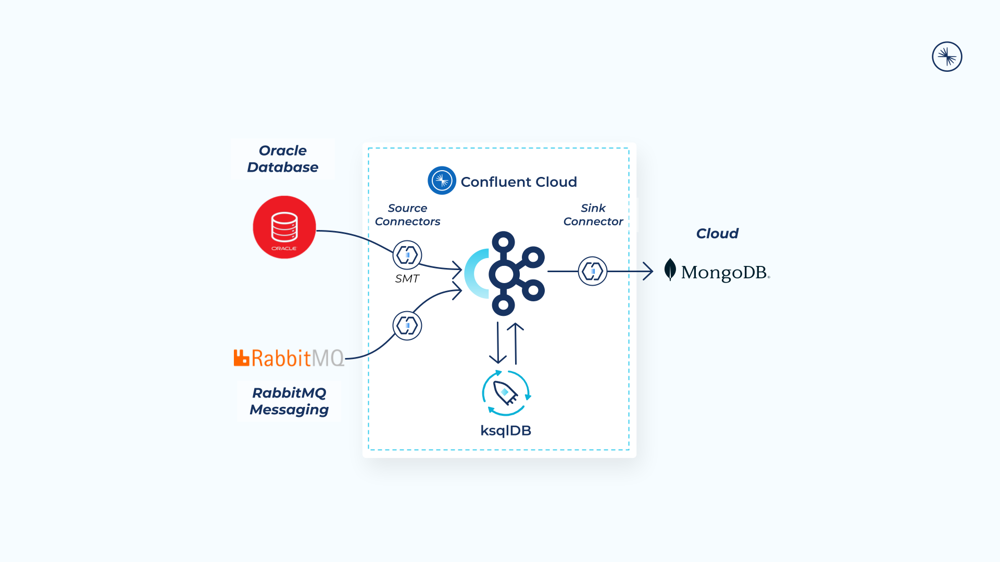
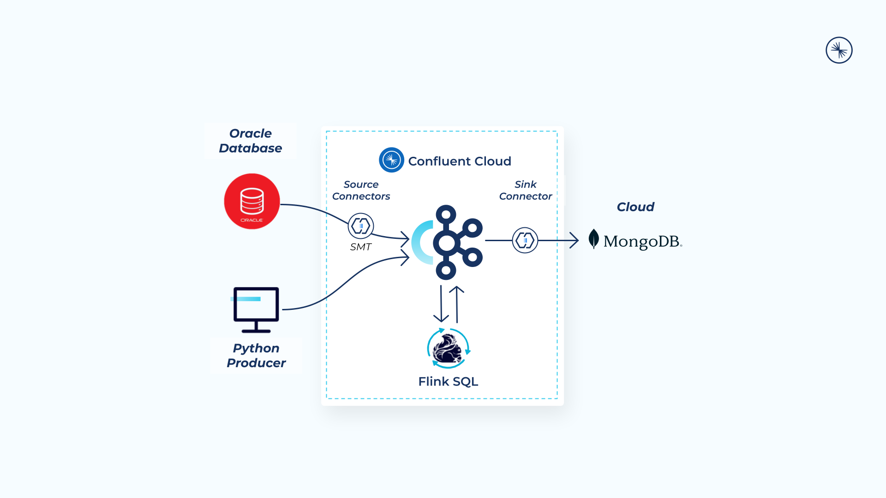

# Stream Data to Cloud Databases with Confluent

Amid unprecedented volumes of data being generated, organizations need to harness the value of their data from heterogeneous systems in real time. However, on-prem databases are slow, rigid, and expensive to maintain, limiting the speed at which businesses can scale and drive innovation. Today’s organizations need scalable, cloud-native databases with real-time data. This demo walks you through building streaming data pipelines with Confluent Cloud. You’ll learn about:

- Confluent’s fully managed source connectors to stream customer data and credit card transactions in real time into Confluent Cloud
- Process and enrich data streams in real time. You'll use aggregates and windowing to create a customer list of potentially stolen credit cards
- A fully managed sink connector to load enriched data into MongoDB Atlas for real-time fraud analysis

Break down data silos and stream on-premises, hybrid, and multicloud data to cloud databases such as MongoDB Atlas, Azure Cosmos DB and more, so that every system and application has a consistent, up-to-date, and enhanced view of the data at all times. With Confluent streaming data pipelines, you can connect, process, and govern real-time data for all of your databases. Unlock real-time insights, focus on building innovative apps instead of managing databases, and confidently pave a path to cloud migration and transformation.

To learn more about Confluent’s solution, visit the [Database streaming pipelines page](https://www.confluent.io/use-case/database)

There are two versions of this demo

1. Using [ksqlDB](./streaming-data-pipelines-with-ksqlDB/) as the stream processing engine.
   - In this version there are two source connectors (Oracle CDC and RabbitMQ)
   - Oracle database contains customers information
   - RabbitMQ contains each customer's credit card transactions
   
 
    
     

1. Using [Flink SQL](./streaming-data-pipelines-with-flink-sql/) as the stream processing engine
   - In this version there is one source connector (Oracle CDC) and one Python producer
   - Oracle database contains customers information
   - Python producer generates sample credit card transactions
   
 
    
    

