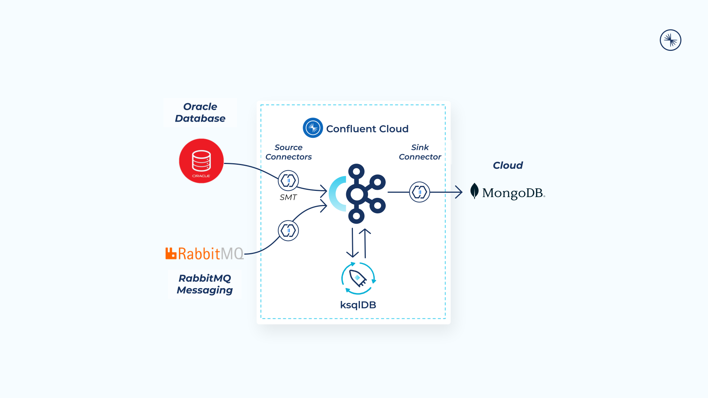

# Stream Data to Cloud Databases with Confluent

Amid unprecedented volumes of data being generated, organizations need to harness the value of their data from heterogeneous systems in real time. However, on-prem databases are slow, rigid, and expensive to maintain, limiting the speed at which businesses can scale and drive innovation. Today’s organizations need scalable, cloud-native databases with real-time data. This demo walks you through building streaming data pipelines with Confluent Cloud. You’ll learn about:

- Confluent’s fully managed Oracle CDC and RabbitMQ Source connectors to stream customer data and credit card transactions in real time into Confluent Cloud
- ksqlDB to process and enrich data streams in real timem. You'll use aggregates and windowing to create a customer list of potentially stolen credit cards
- A fully managed sink connector to load enriched data into MongoDB Atlas for real-time fraud analysis

Break down data silos and stream on-premises, hybrid, and multicloud data to cloud databases such as MongoDB Atlas, Azure Cosmos DB and more, so that every system and application has a consistent, up-to-date, and enhanced view of the data at all times. With Confluent streaming data pipelines, you can connect, process, and govern real-time data for all of your databases. Unlock real-time insights, focus on building innovative apps instead of managing databases, and confidently pave a path to cloud migration and transformation.

To learn more about Confluent’s solution, visit the [Database streaming pipelines page](https://www.confluent.io/use-case/database)

## Architecture Diagram

This demo utilizes two fully-managed source connectors (Oracle CDC Source Premium and RabbitMQ) and one fully-managed sink connector (MongoDB Atlas).

<div align="center"> 
  
</div>

---

# Requirements

In order to successfully complete this demo you need to install few tools before getting started.

- If you don't have a Confluent Cloud account, sign up for a free trial [here](https://www.confluent.io/confluent-cloud/tryfree).
- Install Confluent Cloud CLI by following the instructions [here](https://docs.confluent.io/confluent-cli/current/install.html).
- An AWS account with permissions to create resources. Sign up for an account [here](https://aws.amazon.com/account/).
- Install Oracle DB driver [here](https://oracle.github.io/python-oracledb/).
- This demo uses Python 3.9.13 version.
- This demo uses pyodbc, ccard, and pika modules. You can install this module through `pip`.
  ```
  pip3 install pyodbc ccard pika
  ```
  > **Note:** This demo was built and validate on a Mac (x86).

## Prerequisites

### Confluent Cloud

1. Sign up for a Confluent Cloud account [here](https://www.confluent.io/get-started/).
1. After verifying your email address, access Confluent Cloud sign-in by navigating [here](https://confluent.cloud).
1. When provided with the _username_ and _password_ prompts, fill in your credentials.

   > **Note:** If you're logging in for the first time you will see a wizard that will walk you through the some tutorials. Minimize this as you will walk through these steps in this guide.

1. Create Confluent Cloud API keys by following [this](https://registry.terraform.io/providers/confluentinc/confluent/latest/docs/guides/sample-project#summary) guide.
   > **Note:** This is different than Kafka cluster API keys.

### Oracle Database

1. This demo uses an Oracle Standard Edition database hosted on AWS that is publicly accessible.

### MongoDB Atlas

1. Sign up for a free MongoDB Atlas account [here](https://www.mongodb.com/).

1. Create an API key pair so Terraform can create resources in the Atlas cluster. Follow the instructions [here](https://registry.terraform.io/providers/mongodb/mongodbatlas/latest/docs#configure-atlas-programmatic-access).

### Cloud AMQP

1. Sign up for a free Cloud AMQP account [here](https://www.cloudamqp.com/).

1. Generate an API key so Terraform can create and manage resources [here](https://customer.cloudamqp.com/apikeys).

## Setup

1. This demo uses Terraform and bash script to spin up resources that are needed.

1. Clone and enter this repository.

   ```bash
   git clone https://github.com/confluentinc/demo-database-modernization.git
   cd demo-database-modernization
   ```

1. Create an environment file to manage all the values you'll need through the setup.

   ```bash
    CONFLUENT_CLOUD_EMAIL=<replace>
    CONFLUENT_CLOUD_PASSWORD=<replace>

    CCLOUD_API_KEY=api-key
    CCLOUD_API_SECRET=api-secret
    CCLOUD_BOOTSTRAP_ENDPOINT=kafka-cluster-endpoint

    ORACLE_USERNAME=admin
    ORACLE_PASSWORD=db-mod-c0nflu3nt!
    ORACLE_ENDPOINT=oracle-endpoint
    ORACLE_PORT=1521

    CLOUDAMQP_URL=cloudamqp-url
    CLOUDAMQP_VIRTUAL_HOST=cloudamqp-vhost
    CLOUDAMQP_PASSWORD=cloudamqp-password
    CLOUDAMQP_ENDPOINT=cloudamqp-host

    export TF_VAR_confluent_cloud_api_key="<replace>"
    export TF_VAR_confluent_cloud_api_secret="<replace>"
    export TF_VAR_cloudamqp_customer_api_key="<replace>"
    export TF_VAR_mongodbatlas_public_key="<replace>"
    export TF_VAR_mongodbatlas_private_key="<replace>"
    export TF_VAR_mongodbatlas_org_id="<replace>"

    MONGO_USERNAME=admin
    MONGO_PASSWORD=db-mod-c0nflu3nt!
    MONGO_ENDPOINT=mongodb-endpoint
    MONGO_DATABASE_NAME=demo-db-mod
   ```

1. Update the `.env` file for the following variables with your credentials.

   ```bash
    CONFLUENT_CLOUD_EMAIL=<replace>
    CONFLUENT_CLOUD_PASSWORD=<replace>
    export TF_VAR_confluent_cloud_api_key="<replace>"
    export TF_VAR_confluent_cloud_api_secret="<replace>"
    export TF_VAR_cloudamqp_customer_api_key="<replace>"
    export TF_VAR_mongodbatlas_public_key="<replace>"
    export TF_VAR_mongodbatlas_private_key="<replace>"
    export TF_VAR_mongodbatlas_org_id="<replace>"
   ```

1. Source the `.env` file.
   ```
   source .env
   ```

### Build your cloud infrastructure

1. Navigate to the repo's terraform directory.
   ```bash
   cd terraform
   ```
1. Log into your AWS account through command line.

1. Initialize Terraform within the directory.
   ```bash
   terraform init
   ```
1. Create the Terraform plan.
   ```bash
   terraform plan -out=myplan
   ```
1. Apply the plan to create the infrastructure.

   ```bash
   terraform apply myplan
   ```

   > **Note:** Read the `main.tf` configuration file [to see what will be created](./terraform/main.tf).

1. Write the output of `terraform` to a JSON file. The `env.sh` script will parse the JSON file to update the `.env` file.

   ```bash
   terraform output -json > ../resources.json
   ```

1. Run the `env.sh` script.
   ```bash
   cd demo-database-modernization
   ./env.sh
   ```
1. This script achieves the following:
   - Creates an API key pair that will be used in connectors' configuration files for authentication purposes.
   - Updates the `.env` file to replace the remaining variables with the newly generated values.

### Prepare the Database for Change Data Capture

1. Run the following Python script to create and populate a `CUSTOMERS` table, as well as enable Change Data Capture (CDC) on that table.

   ```bash
   python3 oracle/prepare_database.py
   ```

1. Take a moment to inspect the files in the `oracle` directory to understand what just happened.

### Submit new Credit Card Transactions

1. Use the `creditcard_send.py` [script](./rabbitmq/creditcard_send.py) to continuously populate the **RabbitMQ** instance with sample messages. Leave this running for the demo.

   ```bash
   python3 rabbitmq/creditcard_send.py
   ```

1. To verify that messages are received properly by the server, open a new terminal window and run `creditcard_receive.py` [script](./rabbitmq/creditcard_receive.py). Quit with `Ctrl+C`.
   ```bash
   python3 rabbitmq/creditcard_receive.py
   ```

# Demo

## Configure Source Connectors

Confluent offers 120+ pre-built [connectors](https://www.confluent.io/product/confluent-connectors/), enabling you to modernize your entire data architecture even faster. These connectors also provide you peace-of-mind with enterprise-grade security, reliability, compatibility, and support.

### Automated Connector Configuration File Creation

You can use Confluent Cloud CLI to submit all the source connectors automatically.

1. Run a script that uses your `.env` file to generate real connector configuration json files from the example files located in the `confluent` folder.

   ```bash
   cd demo-database-modernization
   ./confluent/create-connector-files.sh
   ```

### Configure Oracle CDC Source Premium and RabbitMQ Source Connectors

You can create the connectors either through CLI or Confluent Cloud web UI.

<details>
    <summary><b>CLI</b></summary>

1. Log into your Confluent account in the CLI.

   ```bash
   confluent login --save
   ```

1. Use your environment and your cluster.

   ```bash
   confluent environment list
   confluent environment use <your_env_id>
   confluent kafka cluster list
   confluent kafka cluster use <your_cluster_id>
   ```

1. Run the following commands to create Oracle CDC Source Premium and RabbitMQ Source connectors.

   ```bash
   confluent connect cluster create --config-file confluent/actual_oracle_cdc.json
   confluent connect cluster create --config-file confluent/actual_rabbitmq.json
   ```

</details>
<br>

<details>
    <summary><b>Confluent Cloud Web UI</b></summary>

1. Log into Confluent Cloud by navigating to https://confluent.cloud
1. Step into **Demo_Database_Modernization** environment.
1. If you are promoted with **Unlock advanced governance controls** screen, click on **No thanks, I will upgrade later**.
   > **Note:** In this demo, the Essential package for Stream Governance is sufficient. However you can take a moment and review the differences between the Esstentials and Advanced packages.
1. Step into **demo_kafka_cluster**.
1. On the navigation menu, select **Connectors** and then **+ Add connector**.
1. In the search bar search for **Oracle** and select the **Oracle CDC Source Premium** which is a fully-managed connector.
1. Create a new Oracle CDC Source Premium connector and complete the required fields using `actual_oracle_cdc.json` file.
1. Now search for **RabbitMQ** select the **RabbitMQ Source** which is a fully-managed connector.
1. Create a new RabbitMQ Source connector and complete the required fields using `actual_rabbitmq.json` file.

</details>
<br>

In this demo, we are using Apache Kafka's Single Message Transforms (SMT) to mask customer PII field before data streams into Confluent Cloud. For more information on SMTs refer to our [documentation](https://docs.confluent.io/cloud/current/connectors/single-message-transforms.html).

Refer to Oracle CDC Source Premium [documentation](https://docs.confluent.io/cloud/current/connectors/cc-oracle-cdc-source/) and RabbitMQ Source [documentation](https://docs.confluent.io/cloud/current/connectors/cc-rabbitmq-source.html) for detailed instructions and troubleshooting.

## Update Customer Information in Oracle Database

The fully-managed Oracle CDC Source connector for Confluent Cloud captures each change to rows in a database and then represents the changes as change event records in Apache Kafka® topics. You can make changes to the source database (Oracle) and see the updated messages in Confluent Cloud's topic.

1. Navigate to **confluent.cloud → Topics → ORCL.ADMIN.CUSTOMERS → Messages** and keep the page open to see the update.

1. Run a python script to increase Rica Blaisdell's average credit spend by $1 every 5 seconds. Leave this script running throughout the demo.

   ```bash
   python3 oracle/update_user.py
   ```

1. Back in the Confluent Cloud console, verify the Rica Blaisdell's average credit has been updated.

## Enrich Data Streams with ksqlDB

Now that you have data flowing through Confluent, you can now easily build stream processing applications using ksqlDB. You are able to continuously transform, enrich, join, and aggregate your data using simple SQL syntax. You can gain value from your data directly from Confluent in real-time. Also, ksqlDB is a fully managed service within Confluent Cloud with a 99.9% uptime SLA. You can now focus on developing services and building your data pipeline while letting Confluent manage your resources for you.

If you’re interested in learning more about ksqlDB and the differences between streams and tables, I recommend reading these two blogs [here](https://www.confluent.io/blog/kafka-streams-tables-part-3-event-processing-fundamentals/) and [here](https://www.confluent.io/blog/how-real-time-stream-processing-works-with-ksqldb/) or try different use cases by leveraging existing ksqlDB [recipes](https://developer.confluent.io/tutorials/#explore-top-use-cases).

1. On the navigation menu click on **ksqlDB** and step into the cluster you created during setup.

   > NOTE: For your convenience, all these persistent queries are available in the file [ksqldb.sql](./confluent/ksqldb.sql). You can paste the entire contents of that file into the editor to save some time.

To write streaming queries against topics, you will need to register the topics with ksqlDB as a stream or table.

2. **VERY IMPORTANT** -- at the bottom of the editor, set `auto.offset.reset` to `earliest`, or enter the statement:

   ```SQL
   SET 'auto.offset.reset' = 'earliest';
   ```

   If you use the default value of `latest`, then ksqlDB will read form the tail of the topics rather than the beginning, which means streams and tables won't have all the data you think they should.

3. Create a ksqlDB stream from `ORCL.ADMIN.CUSTOMERS` topic.

   ```SQL
   CREATE STREAM fd_cust_raw_stream WITH (KAFKA_TOPIC = 'ORCL.ADMIN.CUSTOMERS', VALUE_FORMAT = 'JSON_SR');
   ```

4. Use the following statement to query `fd_cust_raw_stream` stream to ensure it's being populated correctly.

   ```SQL
   SELECT * FROM fd_cust_raw_stream EMIT CHANGES;
   ```

   Stop the running query by clicking on **Stop**.

5. Create `fd_customers` table based on the `fd_cust_raw_stream` stream you just created.

   ```SQL
   CREATE TABLE fd_customers WITH (FORMAT='JSON_SR') AS
       SELECT id                         AS customer_id,
           LATEST_BY_OFFSET(first_name)  AS first_name,
           LATEST_BY_OFFSET(last_name)   AS last_name,
           LATEST_BY_OFFSET(dob)         AS dob,
           LATEST_BY_OFFSET(email)       AS email,
           LATEST_BY_OFFSET(avg_credit_spend) AS avg_credit_spend
       FROM    fd_cust_raw_stream
       GROUP BY id;
   ```

6. Use the following statement to query `fd_customers` table to ensure it's being populated correctly.

   ```SQL
   SELECT * FROM fd_customers;
   ```

   Stop the running query by clicking on **Stop**.

7. Create the stream of transactions from `rabbitmq_transactions` topic.
   ```SQL
   CREATE STREAM fd_transactions(
       userid DOUBLE,
       transaction_timestamp VARCHAR,
       amount DOUBLE,
       ip_address VARCHAR,
       transaction_id INTEGER,
       credit_card_number VARCHAR
       )
   WITH(KAFKA_TOPIC='rabbitmq_transactions',
        KEY_FORMAT='JSON',
        VALUE_FORMAT='JSON',
        timestamp ='transaction_timestamp',
        timestamp_format = 'yyyy-MM-dd HH:mm:ss');
   ```
8. Use the following statement to query `fd_transactions` stream to ensure it's being populated correctly.

   ```SQL
   SELECT * FROM fd_transactions EMIT CHANGES;
   ```

   Stop the running query by clicking on **Stop**.

9. Join the transactions streams to customer information table.

   ```SQL
   CREATE STREAM fd_transactions_enriched
   WITH (KAFKA_TOPIC = 'transactions_enriched')
   AS SELECT
       T.USERID,
       T.CREDIT_CARD_NUMBER,
       T.AMOUNT,
       T.TRANSACTION_TIMESTAMP,
       C.FIRST_NAME + ' ' + C.LAST_NAME AS FULL_NAME,
       C.AVG_CREDIT_SPEND,
       C.EMAIL
   FROM fd_transactions T
   INNER JOIN fd_customers C
   ON T.USERID = C.CUSTOMER_ID;
   ```

10. Use the following statement to query `fd_transactions_enriched` stream to ensure it's being populated correctly.

    ```SQL
    SELECT * FROM fd_transactions_enriched EMIT CHANGES;
    ```

    Stop the running query by clicking on **Stop**.

11. Aggregate the stream of transactions for each account ID using a two-hour tumbling window, and filter for accounts in which the total spend in a two-hour period is greater than the customer’s average.
    ```SQL
    CREATE TABLE fd_possible_stolen_card
    WITH (KAFKA_TOPIC = 'FD_possible_stolen_card',
          KEY_FORMAT = 'JSON',
          VALUE_FORMAT='JSON')
    AS SELECT
        TIMESTAMPTOSTRING(WINDOWSTART, 'yyyy-MM-dd HH:mm:ss') AS WINDOW_START,
        T.USERID,
        T.CREDIT_CARD_NUMBER,
        T.FULL_NAME,
        T.EMAIL,
        T.TRANSACTION_TIMESTAMP,
        SUM(T.AMOUNT) AS TOTAL_CREDIT_SPEND,
        MAX(T.AVG_CREDIT_SPEND) AS AVG_CREDIT_SPEND
    FROM fd_transactions_enriched T
    WINDOW TUMBLING (SIZE 2 HOURS)
    GROUP BY T.USERID, T.CREDIT_CARD_NUMBER, T.FULL_NAME, T.EMAIL, T.TRANSACTION_TIMESTAMP
    HAVING SUM(T.AMOUNT) > MAX(T.AVG_CREDIT_SPEND);
    ```
12. Use the following statement to query `fd_possible_stolen_card` table to ensure it's being populated correctly.
    ```SQL
    SELECT * FROM fd_possible_stolen_card;
    ```

## Connect MongoDB Atlas to Confluent Cloud

You can create the MongoDB Atlas Sink connector either through CLI or Confluent Cloud web UI.

<details>
    <summary><b>CLI</b></summary>

1. Run the following command to create the MongoDB Atlas Sink connector.

   ```bash
   confluent connect cluster create --config-file confluent/actual_mongodb_sink.json
   ```

</details>
<br>

<details>
    <summary><b>Confluent Cloud Web UI</b></summary>

1. On the navigation menu, select **Connectors** and **+ Add connector**.
1. In the search bar search for **MongoDB** and select the **MongoDB Atlas Sink** which is a fully-managed connector.
1. Create a new MongoDB Atlas Sink connector and complete the required fields using `actual_mongodb_sink.json` file.

</details>
<br>

Once the connector is in **Running** state navigate to **cloud.mongodb.com → Collections → demo-db-mod_FD_possible_stolen_card** and verify messages are showing up correctly.

Refer to our [documentation](https://docs.confluent.io/cloud/current/connectors/cc-mongo-db-sink.html) for detailed instructions about this connector.

## Confluent Cloud Stream Governance

Confluent offers data governance tools such as Stream Quality, Stream Catalog, and Stream Lineage in a package called Stream Governance. These features ensure your data is high quality, observable and discoverable. Learn more about **Stream Governance** [here](https://www.confluent.io/product/stream-governance/) and refer to the [docs](https://docs.confluent.io/cloud/current/stream-governance/overview.html) page for detailed information.

1.  Navigate to https://confluent.cloud
1.  Use the left hand-side menu and click on **Stream Lineage**.
    Stream lineage provides a graphical UI of the end to end flow of your data. Both from the a bird’s eye view and drill-down magnification for answering questions like:

    - Where did data come from?
    - Where is it going?
    - Where, when, and how was it transformed?

    In the bird's eye view you see how one stream feeds into another one. As your pipeline grows and becomes more complex, you can use Stream lineage to debug and see where things go wrong and break.

---

## CONGRATULATIONS

Congratulations on building your streaming data pipelines for streaming data to cloud databases in Confluent Cloud! Your complete pipeline should resemble the following one.


---

# Teardown

You want to delete any resources that were created during the demo so you don't incur additional charges.

## RabbitMQ Script

Go back to the terminal window where the [creditcard_send.py](./rabbitmq/creditcard_send.py) is running and quit with `Ctrl+C`.

## Oracle Script

Go back to the terminal window where the [update_user.py](./oracle/update_user.py) is running and quit with `Ctrl+C`.

## Infrastructure

1. Run the following command to delete all connectors

   ```bash
   ./teardown_connectors.sh
   ```

1. Run the following command to delete all resources created by Terraform
   ```bash
   terraform apply -destory
   ```
1. Furthermore you can delete your CloudAMQP and MongoDB accounts.
   - To delete CloudAMQP account navigate to https://customer.cloudamqp.com/user/settings and then click on **Delete Account** and proceed with confirmation.
   - To delete MongoDB account navigate to cloud.mongodb.com and follow the instructions detailed on the [doc](https://www.mongodb.com/docs/atlas/tutorial/delete-atlas-account/).

# References

1. Database modernization with Confluent Cloud [blog](https://www.confluent.io/blog/cloud-data-migrations-database-modernization-with-confluent/)
2. Peering Connections in Confluent Cloud [doc](https://docs.confluent.io/cloud/current/networking/peering/index.html)
3. Oracle CDC Source Connector for Confluent Cloud [doc](https://docs.confluent.io/cloud/current/connectors/cc-oracle-cdc-source/)
4. Single Message Transforms for Managed Connectors [doc](https://docs.confluent.io/cloud/current/connectors/single-message-transforms.html)
5. RabbitMQ Source Connector for Confluent Cloud [doc](https://docs.confluent.io/cloud/current/connectors/cc-rabbitmq-source.html)
6. ksqlDB [page](https://www.confluent.io/product/ksqldb/) and [use cases](https://developer.confluent.io/tutorials/#explore-top-use-cases)
7. MongoDB Atlas Sink Connector for Confluent Cloud [doc](https://docs.confluent.io/cloud/current/connectors/cc-mongo-db-sink.html)
8. Stream Governance [page](https://www.confluent.io/product/stream-governance/) and [doc](https://docs.confluent.io/cloud/current/stream-governance/overview.html)
