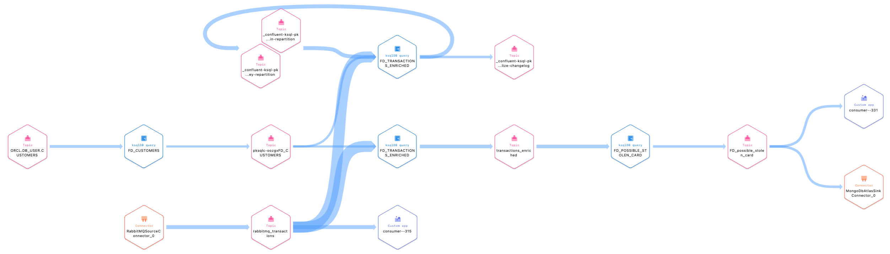

# Database Modernization Demo

There is unprecedented growth in the volumes of data being generated, and it’s essential for businesses to be able to contextualize and harness the value of their data in real time. On-prem databases are slow and rigid, which is expensive in terms of both upfront and ongoing maintenance costs, and as a result, limit the speed at which businesses can scale, experiment, and drive innovation.

Today’s organizations need scalable, cloud-native databases for improved agility, elasticity, and cost-efficiency. With modern databases, companies can focus on building new, real time applications with ease instead of spending time and resources patching, maintaining, and managing their database. Real-time data streaming powered by Apache Kafka® makes it possible to move data reliably at scale while keeping data systems online during the migration through streaming ETL pipelines instead of batch-based processes.

For the full story on Confluent's Database Modernization solution, check out the [database modernization solution page](https://www.confluent.io/use-case/database/).

# Setup

## Set up Local Workstation

The easiest way to run this demo is to launch a preconfigured workspace in Gitpod by clicking this link:
- https://gitpod.io/#https://github.com/confluentinc/demo-10x-storage.git

If you are **not** using Gitpod, then clone this repo and configure your local python environment:

```
git clone https://github.com/confluentinc/demo-database-modernization.git
cd demo-database-modernization
python3 -m venv .venv
source .venv/bin/activate
pip install -r requirements.txt
```

## Set up Confluent Cloud
1. Sign up for a Confluent Cloud account [here](https://www.confluent.io/get-started/).
2. After verifying your email address, access Confluent Cloud sign-in by navigating [here](https://confluent.cloud).
3. When provided with the *username* and *password* prompts, fill in your credentials.
    > **Note:** If you're logging in for the first time you will see a wizard that will walk you through the some tutorials. Minimize this as you will walk through these steps in this guide.

4. Click **+ Add environment**.
    > **Note:** There is a *default* environment ready in your account upon account creation. You can use this *default* environment for the purpose of this demo if you do not wish to create an additional environment.

    * Specify a meaningful `name` for your environment and then click **Create**.
        > **Note:** It will take a few minutes to assign the resources to make this new environment available for use.

5. Now that you have an environment, let's create a cluster. Select **Create Cluster**.
    > **Note**: Confluent Cloud clusters are available in 3 types: **Basic**, **Standard**, and **Dedicated**. Basic is intended for development use cases so you should use that for this demo. Basic clusters only support single zone availability. Standard and Dedicated clusters are intended for production use and support Multi-zone deployments. If you’re interested in learning more about the different types of clusters and their associated features and limits, refer to this [documentation](https://docs.confluent.io/current/cloud/clusters/cluster-types.html).

    * Choose the **Basic** cluster type.

    * Click **Begin Configuration**.

    * Choose **AWS** as your Cloud Provider and your preferred Region. In this demo we use Oregon (West2) as the region. 

    * Specify a meaningful **Cluster Name** and then review the associated *Configuration & Cost*, *Usage Limits*, and *Uptime SLA* before clicking **Launch Cluster**.

### Create an API key pair

1. Select API keys on the navigation menu.
1. If this is your first API key within your cluster, click **Create key**. If you have set up API keys in your cluster in the past and already have an existing API key, click **+ Add key**.
1. Select **Global Access**, then click Next.
    > NOTE: Global access is fine for demo purposes, but in real life, you should scope API keys to service accounts and restrict access of those accounts with Role Based Access Control.
1. Create your key with a description of "demo-database-modernization" to make it easy to search when you need to delete it later.
1. Create a local file called `.env` and add your API key and secret like so:
    ```
    CCLOUD_API_KEY=<your_api_key>
    CCLOUD_API_SECRET=<your_api_secret>
    ```
    > NOTE: There is an example file `example.env` to show you what your `.env` file should look like by the end.
1. After creating and saving the API key, you will see this API key in the Confluent Cloud UI in the API keys tab. If you don’t see the API key populate right away, refresh the browser.

### Enable Schema Registery
1. On the navigation menu, select **Schema Registery**.
1. Click **Set up on my own**.
1. Choose **AWS** as the cloud provider and a supported **Region**
1. Click on **Enable Schema Registry**. 

## Create RabbitMQ topic
1. Navigate to confluent.cloud
2. On the navigation menu, select **Topics** and then **+Add topic** create a new topic with following configurations
```
Topic name: rabbitmq_transactions
Partitions: 1
```

## Create ksqlDB cluster 

ksqlDB is Confluent's stream processing engine that empowers you to create powerful, real-time data pipelines with an accessible SQL syntax.

1. On the navigation menu, select **ksqlDB**.
1. Click on **Create cluster myself**.
1. Choose **Global access** for the access level and hit **Continue**.
1. Pick a name or leave the name as is.
1. Select **1** as the cluster size. 
1. Hit **Launch Cluster!**. 


## Set Up Oracle
### Create an Oracle DB instance
This demo uses AWS RDS Oracle that is publicly accessible. If your database is in a VPC, follow the instructions on our [doc](https://docs.confluent.io/cloud/current/networking/peering/aws-peering.html) page. 
1. Navigate to https://aws.amazon.com/console/ and log into your account. 
2. Search for **RDS** and click on results. 
3. Click on **Create database** and create an Oracle database using the following configurations and leave everything else as default. 
    ```
    Creation method: Standard create
    Engine type: Oracle
    Database management type: Amazon RDS
    Edition: Oracle Standard Editon Two
    License: License-included
    Version: 19.0.0.0.ru-2021-10.rur-2021-10.r1
    Templates: Dev/Test
    DB instance identifier: db-mod-demo
    Master username: admin
    Auto generate a password: check the box
    Public access: Yes
    ```
4. If you opted in using an auto-generated password, ensure you click on **View credentials details** while the instance is being created to download your password.
5. Add your Oracle details to your `.env` file:

    ```
    ORACLE_USERNAME=<my_admin_user>
    ORACLE_PASSWORD=<my_admin_password>
    ORACLE_ENDPOINT=db-mod-demo.<random_characters>.us-west-2.rds.amazonaws.com
    ORACLE_PORT=1521
    ```

### Connect to Oracle with SQL Developer tool (optional)

You can connect to the database with [Oracle SQL Developer](https://www.oracle.com/database/sqldeveloper/) with following connection configuration:

```
Name: demo-database-modernization
Username: admin
Password: <auto_generated_password_from_aws>
Hostname:db-mod-demo.***.us-west-2.rds.amazonaws.com
Port: 1521
SID: ORCL
``` 

### Prepare the Database for Change Data Capture

1. Run the following Python script to create and populate a `CUSTOMERS` table, as well as enable Change Data Capture (CDC) on that table.

    ```
    python oracle/prepare_database.py
    ```

1. Take a moment to inspect the files in the `oracle` directory to understand what just happened. 

## Set up RabbitMQ
This demo uses RabbitMQ as a Service provided by https://www.cloudamqp.com/. 
1. Create a new RabbitMQ instance in the same region as your Confluent Cloud cluster. This demo uses AWS Oregon (US-West-2).
1. Add your information to the `.env` file:
    ```
    CLOUDAMQP_URL=amqps://<my_virtual_host>:<my_rabbitmq_password>@beaver.rmq.cloudamqp.com/<my_virtual_host>
    CLOUDAMQP_VIRTUAL_HOST=<random_characters>
    CLOUDAMQP_PASSWORD=<my_rabbitmq_password>
    CLOUDAMQP_ENDPOINT=beaver-01.rmq.cloudamqp.com
    ```
1. Use the `creditcard_send.py` [script](./rabbitmq/creditcard_send.py) to continuously populate the **RabbitMQ** instance with sample messages. Leave this running for the demo.
1. To verify that messages are received properly by the server, open a new terminal window and run `creditcard_receive.py` [script](./rabbitmq/creditcard_receive.py). Quit with `Ctrl+C`.

## Set up a MongoDB Atlas cluster
1. Sign up for a free MongoDB account [here](https://www.mongodb.com/cloud/atlas/register1). This demo uses AWS Oregon (US-West-2) as the region.
1. Create a **Shared** cluster in the same region as your Confluent cluster (AWS `us-west-2` in this demo) with cluster name **demo-database-modernization**. 
1. Under Security -> Database Access select **+ Add new database user** with username **admin**, password authentication via autogenerated password, and "read and write to any database" role.
1. Add your information to the `.env` file:
    ```
    MONGO_USERNAME=admin
    MONGO_PASSWORD=<my_mongo_password>
    MONGO_ENDPOINT=<my_database>.<random>.mongodb.net
    MONGO_DATABASE_NAME=demo-database-modernization
    ```


# Demo

## Configure Source Connectors

Confluent offers 120+ pre-built [connectors](https://www.confluent.io/product/confluent-connectors/), enabling you to modernize your entire data architecture even faster. These connectors also provide you peace-of-mind with enterprise-grade security, reliability, compatibility, and support.
### Automated Connector Submission (Optional)

If you're in a hurry you can use Confluent Cloud CLI to submit all the source connectors automatically.

1. Run a script that uses your `.env` file to generate real connector configuration json files from the example files located in the `confluent` folder.
    ```
    ./confluent/create-connector-files.sh
    ```
1. Install the `confluent` CLI (skip if running in Gitpod since it's already installed).
    ```
    sudo curl -sL --http1.1 https://cnfl.io/cli | sh -s -- -b /usr/local/bin
    ```
1. Log into your Confluent account in the CLI.
    ```
    confluent login --save
    ```
1. Use your environment and your cluster.
    ```
    confluent environment list
    confluent environment use <your_env_id>
    confluent kafka cluster list
    confluent kafka cluster use <your_cluster_id>
    ```
1. Submit the source connectors:
    ```
    for i in ./confluent/actual_oracle_cdc.json ./confluent/actual_rabbitmq.json; do
        confluent connect create --config $i
    done
    ```

### Configure Oracle CDC Source Premium Connector

1. Log into Confluent Cloud by navigating to https://confluent.cloud
1. On the navigation menu, select **Data Integration** and then **Connectors** and **+ Add connector**.
1. In the search bar search for **Oracle** and select the **Oracle CDC Source Premium** which is a fully-managed connector. 
1. Use the following parameters to configure your connector
    ```json
    {
        "name": "OracleCdcSourceConnector_0",
        "config": {
        "connector.class": "OracleCdcSource",
        "name": "OracleCdcSourceConnector_0",
        "kafka.auth.mode": "KAFKA_API_KEY",
        "kafka.api.key": "<add_your_api_key>",
        "kafka.api.secret": "<add_your_api_secret_key>",
        "oracle.server": "db-mod-demo.***.us-west-2.rds.amazonaws.com",
        "oracle.port": "1521",
        "oracle.sid": "ORCL",
        "oracle.username": "DB_USER",
        "oracle.password": "dbmod",
        "table.inclusion.regex": "ORCL[.]ADMIN[.]CUSTOMERS",
        "start.from": "snapshot",
        "query.timeout.ms": "60000",
        "redo.log.row.fetch.size": "1",
        "table.topic.name.template": "${databaseName}.${schemaName}.${tableName}",
        "lob.topic.name.template": "${databaseName}.${schemaName}.${tableName}.${columnName}",
        "enable.large.lob.object.support": "true",
        "numeric.mapping": "best_fit_or_double",
        "output.data.key.format": "JSON",
        "output.data.value.format": "JSON_SR",
        "transforms": "DoB_Mask",
        "transforms.DoB_Mask.type": "org.apache.kafka.connect.transforms.MaskField$Value",
        "transforms.DoB_Mask.fields": "DOB",
        "transforms.DoB_Mask.replacement": "<xxxx-xx-xx>",
        "tasks.max": "1"
        }
    }
    ```
1. Once the connector is in **Running** state verify the messages exist in **ORCL.ADMIN.CUSTOMERS** topic.

In this demo, we are using Apache Kafka's Single Message Transforms (SMT) to mask customer PII field before data streams into Confluent Cloud. For more information on SMTs refer to our [documentation](https://docs.confluent.io/cloud/current/connectors/single-message-transforms.html).

Refer to our [documentation](https://docs.confluent.io/cloud/current/connectors/cc-oracle-cdc-source/) for detailed instructions for this connector.


### Configure RabbitMQ Source Connector 
1. On the navigation menu, select **Data Integration** and then **Connectors** and **+ Add connector**.
2. In the search bar search for **RabbitMQ** and select the **RabbitMQ Source** which is a fully-managed connector. 
3. Use the following parameters to configure your connector
    ```json
    {
    "name": "RabbitMQSourceConnector_0",
    "config": {
        "connector.class": "RabbitMQSource",
        "name": "RabbitMQSourceConnector_0",
        "kafka.auth.mode": "KAFKA_API_KEY",
        "kafka.api.key": "<add_your_api_key>",
        "kafka.api.secret": "<add_your_api_secret_key>",
        "kafka.topic": "rabbitmq_transactions",
        "rabbitmq.host": "<add_rabbitmq_host>",
        "rabbitmq.username": "<add_rabbitmq_username>",
        "rabbitmq.password": "<add_rabbitmq_password>",
        "rabbitmq.virtual.host": "<add_rabbitmq_virtual_host>",
        "rabbitmq.queue": "txs",
        "tasks.max": "1"
        }
    }
    ```
4. Once the connector is in **Running** state verify the messages exist in **rabbitmq_transactions** topic.

Refer to our [documentation](https://docs.confluent.io/cloud/current/connectors/cc-rabbitmq-source.html) for detailed instructions for this connector.

## Update Customer Information in Oracle Database
The fully-managed Oracle CDC Source connector for Confluent Cloud captures each change to rows in a database and then represents the changes as change event records in Apache Kafka® topics. You can make changes to the source database (Oracle) and see the updated messages in Confluent Cloud's topic. 

1. Navigate to **confluent.cloud → Topics → ORCL.ADMIN.CUSTOMERS → Messages** and keep the page open to see the update.

1. Run a python script to increase Rica Blaisdell's average credit spend by $1 every 5 seconds. Leave this script running throughout the demo.
    ```
    python oracle/update_user.py
    ```

1. Back in the Confluent Cloud console, verify the Rica Blaisdell's average credit has been updated. 


## Enrich Data Streams with ksqlDB

Now that you have data flowing through Confluent, you can now easily build stream processing applications using ksqlDB. You are able to continuously transform, enrich, join, and aggregate your data using simple SQL syntax. You can gain value from your data directly from Confluent in real-time. Also, ksqlDB is a fully managed service within Confluent Cloud with a 99.9% uptime SLA. You can now focus on developing services and building your data pipeline while letting Confluent manage your resources for you.

If you’re interested in learning more about ksqlDB and the differences between streams and tables, I recommend reading these two blogs [here](https://www.confluent.io/blog/kafka-streams-tables-part-3-event-processing-fundamentals/) and [here](https://www.confluent.io/blog/how-real-time-stream-processing-works-with-ksqldb/) or try different use cases by leveraging existing ksqlDB [recipes](https://developer.confluent.io/tutorials/#explore-top-use-cases). 

1. On the navigation menu click on **ksqlDB** and step into the cluster you created during setup.

    > NOTE: For your convenience, all these persistent queries are available in the file [ksqldb.sql](./confluent/ksqldb.sql). You can paste the entire contents of that file into the editor to save some time.

To write streaming queries against topics, you will need to register the topics with ksqlDB as a stream or table.

2. **VERY IMPORTANT** -- at the bottom of the editor, set `auto.offset.reset` to `earliest`, or enter the statement:
    ```SQL
    SET 'auto.offset.reset' = 'earliest';
    ```
    If you use the default value of `latest`, then ksqlDB will read form the tail of the topics rather than the beginning, which means streams and tables won't have all the data you think they should.

3. Create a ksqlDB stream from `ORCL.ADMIN.CUSTOMERS` topic.
    ```SQL
    CREATE STREAM fd_cust_raw_stream
    WITH (KAFKA_TOPIC = 'ORCL.ADMIN.CUSTOMERS',
          VALUE_FORMAT = 'JSON_SR');
    ```

4. Use the following statement to query `fd_cust_raw_stream` stream to ensure it's being populated correctly.
    ```SQL
    SELECT * FROM fd_cust_raw_stream EMIT CHANGES;
    ```
    Stop the running query by clicking on **Stop**.

5. Create `fd_customers` table based on the `fd_cust_raw_stream` stream you just created. 
    ```SQL
    CREATE TABLE fd_customers WITH (FORMAT='JSON_SR') AS 
        SELECT id                         AS customer_id,
            LATEST_BY_OFFSET(first_name)  AS first_name,
            LATEST_BY_OFFSET(last_name)   AS last_name,
            LATEST_BY_OFFSET(dob)         AS dob,
            LATEST_BY_OFFSET(email)       AS email,
            LATEST_BY_OFFSET(avg_credit_spend) AS avg_credit_spend
        FROM    fd_cust_raw_stream 
        GROUP BY id;
    ```

6. Use the following statement to query `fd_customers` table to ensure it's being populated correctly.
    ```SQL
    SELECT * FROM fd_customers;
    ```
    Stop the running query by clicking on **Stop**.

7. Create the stream of transactions from `rabbitmq_transactions` topic.
    ```SQL
    CREATE STREAM fd_transactions(
        userid DOUBLE,
        transaction_timestamp VARCHAR,
        amount DOUBLE,
        ip_address VARCHAR,
        transaction_id INTEGER,
        credit_card_number VARCHAR
        )
    WITH(KAFKA_TOPIC='rabbitmq_transactions',
         KEY_FORMAT='JSON',
         VALUE_FORMAT='JSON',
         timestamp ='transaction_timestamp',
         timestamp_format = 'yyyy-MM-dd HH:mm:ss');
    ```
9. Use the following statement to query `fd_transactions` stream to ensure it's being populated correctly.
    ```SQL
    SELECT * FROM fd_transactions EMIT CHANGES;
    ```
    Stop the running query by clicking on **Stop**.

11. Join the transactions streams to customer information table.
    ```SQL
    CREATE STREAM fd_transactions_enriched
    WITH (KAFKA_TOPIC = 'transactions_enriched')
    AS SELECT
        T.USERID,
        T.CREDIT_CARD_NUMBER,
        T.AMOUNT,
        T.TRANSACTION_TIMESTAMP,
        C.FIRST_NAME + ' ' + C.LAST_NAME AS FULL_NAME,
        C.AVG_CREDIT_SPEND,
        C.EMAIL
    FROM fd_transactions T
    INNER JOIN fd_customers C
    ON T.USERID = C.CUSTOMER_ID;
    ```

12. Use the following statement to query `fd_transactions_enriched` stream to ensure it's being populated correctly.
    ```SQL
    SELECT * FROM fd_transactions_enriched EMIT CHANGES;
    ```
    Stop the running query by clicking on **Stop**.

14. Aggregate the stream of transactions for each account ID using a two-hour tumbling window, and filter for accounts in which the total spend in a two-hour period is greater than the customer’s average.
    ```SQL
    CREATE TABLE fd_possible_stolen_card
    WITH (KAFKA_TOPIC = 'FD_possible_stolen_card',
          KEY_FORMAT = 'JSON',
          VALUE_FORMAT='JSON')
    AS SELECT
        TIMESTAMPTOSTRING(WINDOWSTART, 'yyyy-MM-dd HH:mm:ss') AS WINDOW_START,
        T.USERID,
        T.CREDIT_CARD_NUMBER,
        T.FULL_NAME,
        T.EMAIL,
        T.TRANSACTION_TIMESTAMP,
        SUM(T.AMOUNT) AS TOTAL_CREDIT_SPEND,
        MAX(T.AVG_CREDIT_SPEND) AS AVG_CREDIT_SPEND
    FROM fd_transactions_enriched T
    WINDOW TUMBLING (SIZE 2 HOURS)
    GROUP BY T.USERID, T.CREDIT_CARD_NUMBER, T.FULL_NAME, T.EMAIL, T.TRANSACTION_TIMESTAMP
    HAVING SUM(T.AMOUNT) > MAX(T.AVG_CREDIT_SPEND);
    ```
15. Use the following statement to query `fd_possible_stolen_card` table to ensure it's being populated correctly.
    ```SQL
    SELECT * FROM fd_possible_stolen_card;
    ```

## Connect MongoDB Atlas to Confluent Cloud

0. (Optional) If you have been using the `confluent` CLI to submit connectors, run this CLI command to submit your MonogoDB sink connector:
    ```
    confluent connect create \
        --config ./confluent/actual_mongodb_sink.json
    ```
1. On the navigation menu, select **Data Integration** and then **Connectors** and **+ Add connector**.
2. In the search bar search for **MongoDB** and select the **MongoDB Atlas Sink** which is a fully-managed connector. 
3. Use the following parameters to configure your connector
    ```json
    {
    "name": "MongoDbAtlasSinkConnector_0",
    "config": {
        "connector.class": "MongoDbAtlasSink",
        "name": "MongoDbAtlasSinkConnector_0",
        "input.data.format": "JSON",
        "kafka.auth.mode": "KAFKA_API_KEY",
        "kafka.api.key": "<add_your_api_key>",
        "kafka.api.secret": "<add_your_api_secret_key>",
        "topics": "FD_possible_stolen_card",
        "connection.host": "<database-host-address>",
        "connection.user": "<add_MongoDB_username>",
        "connection.password": "<add_MongoDB_password>",
        "database": "<database-name>",
        "doc.id.strategy": "FullKeyStrategy",
        "tasks.max": "1"
        }
    }
    ```

4. Once the connector is in **Running** state navigate to **cloud.mongodb.com → Collections → demo-database-modernization_FD_possible_stolen_card** and verify messages are showing up correctly. 

Refer to our [documentation](https://docs.confluent.io/cloud/current/connectors/cc-mongo-db-sink.html) for detailed instructions about this connector. 

## Confluent Cloud Stream Governance

Confluent offers data governance tools such as Stream Quality, Stream Catalog, and Stream Lineage in a package called Stream Governance. These features ensure your data is high quality, observable and discoverable. Learn more about **Stream Governance** [here](https://www.confluent.io/product/stream-governance/) and refer to the [docs](https://docs.confluent.io/cloud/current/stream-governance/overview.html) page for detailed information. 

1. Navigate to https://confluent.cloud
2. Use the left hand-side menu and click on **Stream Lineage**. 
Stream lineage provides a graphical UI of the end to end flow of your data. Both from the a bird’s eye view and drill-down magnification for answering questions like:
    * Where did data come from?
    * Where is it going?
    * Where, when, and how was it transformed?
In the bird's eye view you see how one stream feeds into another one. As your pipeline grows and becomes more complex, you can use Stream lineage to debug and see where things go wrong and break.
<div align="center" padding=25px>
   
</div>

# Teardown
You want to delete any resources that were created during the demo so you don't incur additional charges. 

## RabbitMQ Script

1. Go back to the terminal window where the [creditcard_send.py](./rabbitmq/creditcard_send.py) is running and quit with `Ctrl+C`.

## Oracle Script

1. Go back to the terminal window where the [update_user.py](./oracle/update_user.py) is running and quit with `Ctrl+C`.
## Confluent Cloud 
1. Navigate to https://confluent.cloud
Use the left hand-side menu and click on **ksqlDB** and step into your **ksqlDB application**.

2. SET 'auto.offset.reset' = 'earliest';

3. Use the editor and run the following queries.
    ```SQL
    drop table fd_possible_stolen_card;
    drop stream fd_transactions_enriched;
    drop stream fd_transactions;
    drop table fd_customers;
    drop stream fd_cust_raw_stream;
    ```
4. Use the left hand-side menue select **Data Integration** and then **Connectors**.

5. Click on each connector's name and delete them. 
    > Alternatively, you can delete connectors through REST API calls. Refer to our [docs](https://docs.confluent.io/cloud/current/connectors/connect-api-section.html) for detailed instructions. 

6. Use the left hand-side menu select **Data Integration** and then **API Keys**. Click on each key and hit **Delete API key**. 

8. Finally, delete the cluster and the environment. 

## AWS 
1. Navigate to https://aws.amazon.com/console/ and log into your account. 

2. Search for **RDS** and click on results. 

3. Use the left hand-side menu and click on **Databases → db-mod-demo → Actions → Delete** and proceed with deleting the database instance. 

## RabbitMQ
1. Navigate to https://customer.cloudamqp.com/user/settings

2. Click on **Delete Account** and proceed with confirmation. 

## MongoDB Atlas
1. Navigate to cloud.mongodb.com

2. Follow the instructions in the [doc](https://www.mongodb.com/docs/atlas/tutorial/delete-atlas-account/) to delete your account. 

# References
1. Database modernization with Confluent Cloud [blog](https://www.confluent.io/blog/cloud-data-migrations-database-modernization-with-confluent/)
2. Peering Connections in Confluent Cloud [doc](https://docs.confluent.io/cloud/current/networking/peering/index.html)
3. Oracle CDC Source Connector for Confluent Cloud [doc](https://docs.confluent.io/cloud/current/connectors/cc-oracle-cdc-source/)
4. Single Message Transforms for Managed Connectors [doc](https://docs.confluent.io/cloud/current/connectors/single-message-transforms.html)
5. RabbitMQ Source Connector for Confluent Cloud [doc](https://docs.confluent.io/cloud/current/connectors/cc-rabbitmq-source.html)
6. ksqlDB [page](https://www.confluent.io/product/ksqldb/) and [use cases](https://developer.confluent.io/tutorials/#explore-top-use-cases)
7. MongoDB Atlas Sink Connector for Confluent Cloud [doc](https://docs.confluent.io/cloud/current/connectors/cc-mongo-db-sink.html)
8. Stream Governance [page](https://www.confluent.io/product/stream-governance/) and [doc](https://docs.confluent.io/cloud/current/stream-governance/overview.html)
