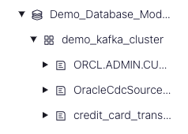
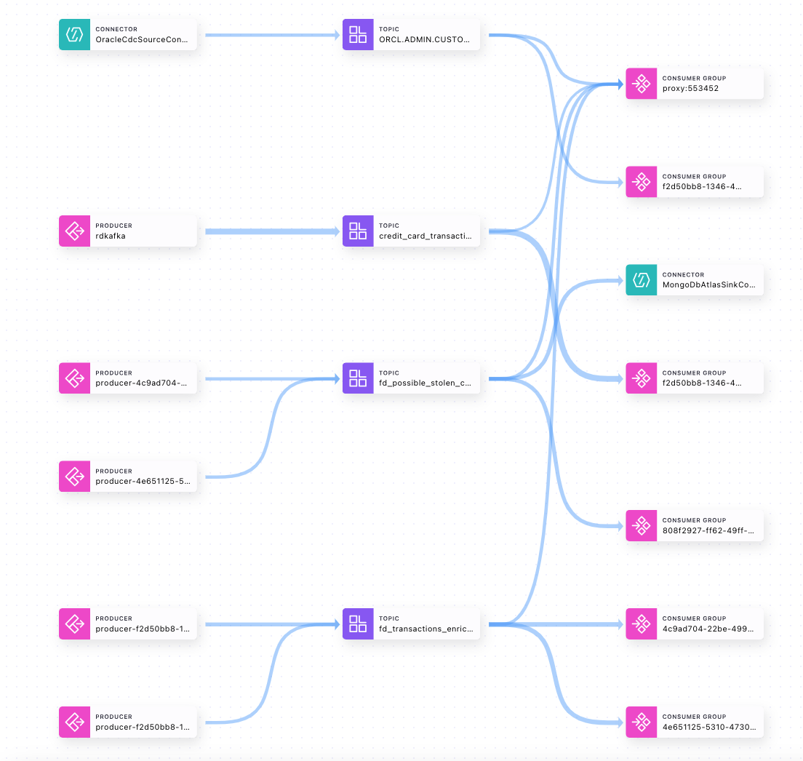

# Stream Data to Cloud Databases with Confluent

Amid unprecedented volumes of data being generated, organizations need to harness the value of their data from heterogeneous systems in real time. However, on-prem databases are slow, rigid, and expensive to maintain, limiting the speed at which businesses can scale and drive innovation. Today’s organizations need scalable, cloud-native databases with real-time data. This demo walks you through building streaming data pipelines with Confluent Cloud. You’ll learn about:

- Confluent’s fully managed [Oracle CDC Source](https://docs.confluent.io/cloud/current/connectors/cc-oracle-cdc-source/cc-oracle-cdc-source-features.html) connector to stream customer data real time into Confluent Cloud while masking sensitive information with [Single Message Transforms](https://docs.confluent.io/cloud/current/connectors/single-message-transforms.html)
- Python producer to send messages to a Kafka topic
- [Flink SQL](https://docs.confluent.io/cloud/current/flink/index.html) to process and enrich data streams in real time. You'll use aggregates and windowing to create a customer list of potentially stolen credit cards
- A fully managed sink connector to load enriched data into [MongoDB Atlas](https://docs.confluent.io/cloud/current/connectors/cc-mongo-db-sink.html) for real-time fraud analysis

Break down data silos and stream on-premises, hybrid, and multicloud data to cloud databases such as MongoDB Atlas, Azure Cosmos DB and more, so that every system and application has a consistent, up-to-date, and enhanced view of the data at all times. With Confluent streaming data pipelines, you can connect, process, and govern real-time data for all of your databases. Unlock real-time insights, focus on building innovative apps instead of managing databases, and confidently pave a path to cloud migration and transformation.

To learn more about Confluent’s solution, visit the [Database streaming pipelines page](https://www.confluent.io/use-case/database)

## Architecture Diagram

This demo leverages two fully-managed connectors (Oracle CDC Source Premium and MongoDB Atlas Sink).

<div align="center"> 
  
</div>

---

# Requirements

In order to successfully complete this demo you need to install few tools before getting started.

- If you don't have a Confluent Cloud account, sign up for a free trial [here](https://www.confluent.io/confluent-cloud/tryfree).
- Install Confluent Cloud CLI by following the instructions [here](https://docs.confluent.io/confluent-cli/current/install.html).
- AWS account with permissions to create resources. Sign up for an account [here](https://aws.amazon.com/account/).
- Install Oracle DB driver [here](https://oracle.github.io/python-oracledb/).
- This demo uses Python 3.9.x version.
- This demo uses pyodbc and faker modules. You can install this module through `pip`.

  ```
  pip3 install pyodbc faker
  ```

  > **Note:** This demo was built and validate on a Mac (x86).

- Download and Install Terraform [here](https://developer.hashicorp.com/terraform/downloads?ajs_aid=837a4ee4-253b-4b3d-bf11-952575792ad1&product_intent=terraform)

## Prerequisites

### Confluent Cloud

1. Sign up for a Confluent Cloud account [here](https://www.confluent.io/get-started/).
1. After verifying your email address, access Confluent Cloud sign-in by navigating [here](https://confluent.cloud).
1. When provided with the _username_ and _password_ prompts, fill in your credentials.

   > **Note:** If you're logging in for the first time you will see a wizard that will walk you through the some tutorials. Minimize this as you will walk through these steps in this guide.

### AWS

This demo uses an Oracle Standard Edition database hosted on AWS that is publicly accessible.

### MongoDB Atlas

Sign up for a free MongoDB Atlas account [here](https://www.mongodb.com/).

---

## Setup

1. This demo uses Terraform and bash scripting to create and teardown infrastructure and resources.

1. Clone and enter this repository.

   ```bash
   git clone https://github.com/confluentinc/demo-database-modernization.git
   cd demo-database-modernization
   ```

1. Create an `.accounts` file by running the following command.

   ```bash
   echo "CONFLUENT_CLOUD_EMAIL=add_your_email\nCONFLUENT_CLOUD_PASSWORD=add_your_password\nexport TF_VAR_confluent_cloud_api_key=\"add_your_api_key\"\nexport TF_VAR_confluent_cloud_api_secret=\"add_your_api_secret\"\nexport TF_VAR_mongodbatlas_public_key=\"add_your_public_key\"\nexport TF_VAR_mongodbatlas_private_key=\"add_your_private_key\"\nexport TF_VAR_mongodbatlas_org_id=\"add_your_org_id\"" > .accounts
   ```

   > **Note:** This repo ignores `.accounts` file

### Confluent Cloud

Create Confluent Cloud API keys by following [this](https://registry.terraform.io/providers/confluentinc/confluent/latest/docs/guides/sample-project#summary) guide.

> **Note:** This is different than Kafka cluster API keys.

### MongoDB Atlas

Create an API key pair so Terraform can create resources in the Atlas cluster. Follow the instructions [here](https://registry.terraform.io/providers/mongodb/mongodbatlas/latest/docs#configure-atlas-programmatic-access).

Update the `.accounts` file for the following variables with your credentials.

```bash
 CONFLUENT_CLOUD_EMAIL=<replace>
 CONFLUENT_CLOUD_PASSWORD=<replace>
 export TF_VAR_confluent_cloud_api_key="<replace>"
 export TF_VAR_confluent_cloud_api_secret="<replace>"
 export TF_VAR_mongodbatlas_public_key="<replace>"
 export TF_VAR_mongodbatlas_private_key="<replace>"
 export TF_VAR_mongodbatlas_org_id="<replace>"
```

### Create a local environment file

1. Navigate to the `confluent` directory of the project and run `create_env.sh` script. This bash script copies the content of `.accounts` file into a new file called `.env` and append additional variables to it.

   ```bash
   cd demo-database-modernization/confluent
   ./create_env.sh
   ```

1. Source `.env` file.

   ```bash
   source ../.env
   ```

   > **Note:** if you don't source `.env` file you'll be prompted to manually provide the values through command line when running Terraform commands.

### Build your cloud infrastructure

1. Log into your AWS account through command line.

1. Navigate to the repo's terraform directory.

   ```bash
   cd demo-database-modernization/terraform
   ```

1. Initialize Terraform within the directory.
   ```bash
   terraform init
   ```
1. Create the Terraform plan.
   ```bash
   terraform plan
   ```
1. Apply the plan to create the infrastructure. You can run `terraform apply -auto-approve` to bypass the approval prompt.

   ```bash
   terraform apply
   ```

   > **Note:** Read the `main.tf` configuration file [to see what will be created](./terraform/main.tf).

1. Write the output of `terraform` to a JSON file. The `setup.sh` script will parse the JSON file to update the `.env` file.

   ```bash
   terraform output -json > ../resources.json
   ```

1. Run the `setup.sh` script.
   ```bash
   cd demo-database-modernization/confluent
   ./setup.sh
   ```
1. This script achieves the following:

   - Creates an API key pair that will be used in connectors' configuration files for authentication purposes.
   - Updates the `.env` file to replace the remaining variables with the newly generated values.

1. Source `.env` file.

   ```bash
   source ../.env
   ```

### Prepare the Database for Change Data Capture

1. Run the following Python script to create and populate a `CUSTOMERS` table, as well as enable Change Data Capture (CDC) on that table.

   ```bash
   cd demo-database-modernization/oracle
   python3 prepare_database.py
   ```

1. Take a moment to inspect the files in the `oracle` directory to understand what just happened.

# Demo

## Configure Source Connector

Confluent offers 120+ pre-built [connectors](https://www.confluent.io/product/confluent-connectors/), enabling you to modernize your entire data architecture even faster. These connectors also provide you peace-of-mind with enterprise-grade security, reliability, compatibility, and support.

### Automated Connector Configuration File Creation

You can use Confluent Cloud CLI to submit all the source connectors automatically.

Run a script that uses your `.env` file to generate real connector configuration json files from the example files located in the `confluent` folder.

```bash
cd demo-database-modernization/confluent
./create_connector_files.sh
```

### Configure Oracle CDC Source Premium Source Connectors

You can create the connector either through CLI or Confluent Cloud web UI.

<details>
    <summary><b>CLI</b></summary>

1. Log into your Confluent account in the CLI.

   ```bash
   confluent login --save
   ```

1. Use your environment and your cluster.

   ```bash
   confluent environment list
   confluent environment use <your_env_id>
   confluent kafka cluster list
   confluent kafka cluster use <your_cluster_id>
   ```

1. Run the following commands to create Oracle CDC Source Premium and RabbitMQ Source connectors.

   ```bash
   cd demo-database-modernization/confluent
   confluent connect cluster create --config-file actual_oracle_cdc.json
   ```

</details>
<br>

<details>
    <summary><b>Confluent Cloud Web UI</b></summary>

1. Log into Confluent Cloud by navigating to https://confluent.cloud
1. Step into **Demo_Database_Modernization** environment.
1. If you are promoted with **Unlock advanced governance controls** screen, click on **No thanks, I will upgrade later**.
   > **Note:** In this demo, the Essential package for Stream Governance is sufficient. However you can take a moment and review the differences between the Esstentials and Advanced packages.
1. Step into **demo_kafka_cluster**.
1. On the navigation menu, select **Connectors** and then **+ Add connector**.
1. In the search bar search for **Oracle** and select the **Oracle CDC Source Premium** which is a fully-managed connector.
1. Create a new Oracle CDC Source Premium connector and complete the required fields using `actual_oracle_cdc.json` file.

</details>
<br>

Once both are fully provisioned, check for and troubleshoot any failures that occur. Properly configured, each connector begins reading data automatically.

In this demo, we are using Apache Kafka's Single Message Transforms (SMT) to mask customer PII field before data streams into Confluent Cloud. For more information on SMTs refer to our [documentation](https://docs.confluent.io/cloud/current/connectors/single-message-transforms.html).

## Update Customer Information in Oracle Database

The fully-managed Oracle CDC Source connector for Confluent Cloud captures each change to rows in a database and then represents the changes as change event records in Apache Kafka® topics. You can make changes to the source database (Oracle) and see the updated messages in Confluent Cloud's topic.

1. Navigate to **confluent.cloud → Topics → ORCL.ADMIN.CUSTOMERS → Messages** and keep the page open to see the update.

1. Run a python script to increase Rica Blaisdell's average credit spend by $1 every 5 seconds. Leave this script running throughout the demo.

   ```bash
   cd demo-database-modernization/oracle
   python3 update_user.py
   ```

1. Back in the Confluent Cloud console, verify the Rica Blaisdell's average credit has been updated.

## Submit new credit card transactions

In a real world scenario, the credit card transactions might be coming from a web application, a database or other sources. To keep things simple in this demo, you'll use a Python producer to generate sample credit card transactions.

1. Open a new `Terminal` window.

1. Run the `creditcard_send.py` script
   ```bash
   cd demo-database-modernization/cc_transaction_scripts
   python3 creditcard_send.py
   ```
1. This script generates a sample credit card transaction every second using the Faker library. The messages are serialized with JSON schema and Schema Registry keeps track of its evolution. Schema Registry provides a centralized repository for managing and validating schemas for topic message data, and for serialization and deserialization of the data over the network.

## Enrich Data Streams with Flink SQL

Now that you have data flowing through Confluent, you can now easily build stream processing applications using Flink SQL. You are able to continuously transform, enrich, join, and aggregate your data using SQL syntax. You can gain value from your data directly from Confluent in real-time. Also, Confluent Cloud for Flink provides a truly cloud-native experience for Flink. You don’t need to know about or interact with Flink clusters, state backends, checkpointing, and all of the other aspects that are usually involved when operating a production-ready Flink deployment.

If you’re interested in learning more about Flink, you can take the Apache Flink 101 course on Confluent Developer [website](https://developer.confluent.io/courses/apache-flink/intro/).

1. Log into [Confluent Cloud web UI](confluent.cloud), then click on **Demo_Database_Modernization** environment.
1. Click on **Flink (preview)** and then **Open SQL workspace**.
1. On the top right corner of your workspace select **Demo_Database_Modernization** as the catalog and **demo_kafka_cluster** as your database.

   _Refer to the [docs](https://docs.confluent.io/cloud/current/flink/index.html#metadata-mapping-between-ak-cluster-topics-schemas-and-af) to understand the mapping between Kafka and Flink._

1. On the left-hand side under **Navigator** menu, click the arrow to expand the **Demo_Database_Modernization** Kafka environment, and expand the **demo_kafka_cluster** to see existing Kafka topics. It should resemble the following image
   <div align="center"> 
      
   </div>

1. You will use the code editor to query existing Flink tables (Kafka topics) and to write new queries.

1. To write a new query, click on the **+** icon to create a new cell.

   > **Note:** For your convenience, all Flink queries are availble in the [flink-queries.sql](./confluent/flink-queries.sql) file.

1. Query the `ORCL.ADMIN.CUSTOMERS` table and then hit **Stop**.

   ```sql
   SELECT * FROM `ORCL.ADMIN.CUSTOMERS`;
   ```

   > **Note**: This topic is named as <database_name>.<schema_name>.<table_name> and you need the backtick otherwise Flink SQL would assume you are referring to a specific catalog and database.

1. Add a new cell and query the `credit_card_transactions` table and then hit **Stop**.

   ```sql
   SELECT * FROM credit_card_transactions;
   ```

1. Add a new cell. You will create a new table and join customer's information with credit card transaction matching on customer's id. The `transaction_timestamp` is used as the WATERMARK strategy. The CAST function is used, to cast the `transaction_timestamp` from `String` to `Timestamp`.

   ```sql
   CREATE TABLE fd_transactions_enriched(
      `user_id` BIGINT,
      `credit_card_number` STRING,
      `amount` DOUBLE,
      `transaction_timestamp` TIMESTAMP(0),
      `first_name` STRING,
      `last_name` STRING,
      `email` STRING,
      `avg_credit_spend` DOUBLE,
      WATERMARK FOR transaction_timestamp AS transaction_timestamp
   );

   INSERT INTO fd_transactions_enriched
      SELECT T.user_id,
         T.credit_card_number,
         T.amount,
         CAST(T.transaction_timestamp AS TIMESTAMP),
         C.FIRST_NAME,
         C.LAST_NAME,
         C.EMAIL,
         C.AVG_CREDIT_SPEND
      FROM credit_card_transactions T
      INNER JOIN `ORCL.ADMIN.CUSTOMERS` C
      ON T.user_id = C.ID;
   ```

1. Add a new cell and query the newly created `fd_transactions_enriched` table and verify it's populated correctly.
   ```sql
   SELECT * FROM fd_transactions_enriched;
   ```
1. Add a new cell and create a new table. You'll aggregate the stream of transactions for each account ID using a two-hour tumbling window, and filter for accounts in which the total spend in a two-hour period is greater than the customer’s average.

   ```sql
   CREATE TABLE fd_possible_stolen_card(
      `window_start` TIMESTAMP(0),
      `window_end` TIMESTAMP(0),
      `user_id` BIGINT,
      `credit_card_number` STRING,
      `first_name` STRING,
      `last_name` STRING,
      `email` STRING,
      `transaction_timestamp` TIMESTAMP(0),
      `total_credit_spend` DOUBLE,
      `avg_credit_spend` DOUBLE
   );
   INSERT INTO fd_possible_stolen_card
      SELECT window_start, window_end, user_id, credit_card_number, first_name, last_name, email, transaction_timestamp, SUM(amount) AS total_credit_spend, MAX(avg_credit_spend) as avg_credit_spend
      FROM TABLE (
         TUMBLE(TABLE fd_transactions_enriched, DESCRIPTOR(transaction_timestamp), INTERVAL '2' HOUR ))
      GROUP BY window_start, window_end, user_id, credit_card_number, first_name, last_name, email, transaction_timestamp
      HAVING SUM(amount) > MAX(avg_credit_spend);
   ```

1. Add a new cell and verify the newly created table is being populated correctly.

   ```sql
   SELECT * FROM fd_possible_stolen_card;
   ```

---

## Connect MongoDB Atlas to Confluent Cloud

You can create the MongoDB Atlas Sink connector either through CLI or Confluent Cloud web UI.

<details>
    <summary><b>CLI</b></summary>

1. Run the following command to create the MongoDB Atlas Sink connector.

   ```bash
   confluent connect cluster create --config-file confluent/actual_mongodb_sink.json
   ```

</details>
<br>

<details>
    <summary><b>Confluent Cloud Web UI</b></summary>

1. On the navigation menu, select **Connectors** and **+ Add connector**.
1. In the search bar search for **MongoDB** and select the **MongoDB Atlas Sink** which is a fully-managed connector.
1. Create a new MongoDB Atlas Sink connector and complete the required fields using `actual_mongodb_sink.json` file.

</details>
<br>

Once the connector is in **Running** state navigate to **cloud.mongodb.com → Collections → demo-db-mod.fd_possible_stolen_card** and verify messages are showing up correctly.

Refer to our [documentation](https://docs.confluent.io/cloud/current/connectors/cc-mongo-db-sink.html) for detailed instructions about this connector.

## Confluent Cloud Stream Governance

Confluent offers data governance tools such as Stream Quality, Stream Catalog, and Stream Lineage in a package called Stream Governance. These features ensure your data is high quality, observable and discoverable. Learn more about **Stream Governance** [here](https://www.confluent.io/product/stream-governance/) and refer to the [docs](https://docs.confluent.io/cloud/current/stream-governance/overview.html) page for detailed information.

1.  Navigate to https://confluent.cloud
1.  Use the left hand-side menu and click on **Stream Lineage**.
    Stream lineage provides a graphical UI of the end to end flow of your data. Both from the a bird’s eye view and drill-down magnification for answering questions like:

    - Where did data come from?
    - Where is it going?
    - Where, when, and how was it transformed?

    In the bird's eye view you see how one stream feeds into another one. As your pipeline grows and becomes more complex, you can use Stream lineage to debug and see where things go wrong and break.

---

## CONGRATULATIONS

Congratulations on building your streaming data pipelines for streaming data to cloud databases in Confluent Cloud! Your complete pipeline should resemble the following one.

   <div align="center"> 
      
   </div>

---

# Teardown

You want to delete any resources that were created during the demo so you don't incur additional charges.

## Credit Card Transactions Script

Go back to the terminal window where the [creditcard_send.py](./cc_transaction_scripts/creditcard_send.py) is running and quit with `Ctrl+C`.

## Oracle Script

Go back to the terminal window where the [update_user.py](./oracle/update_user.py) is running and quit with `Ctrl+C`.

## Infrastructure

1. Run the following command to delete all connectors

   ```bash
   ./teardown_connectors.sh
   ```

1. Run the following command to delete all resources created by Terraform
   ```bash
   terraform destroy
   ```

# References

1. Database modernization with Confluent Cloud [blog](https://www.confluent.io/blog/cloud-data-migrations-database-modernization-with-confluent/)
1. Peering Connections in Confluent Cloud [doc](https://docs.confluent.io/cloud/current/networking/peering/index.html)
1. Oracle CDC Source Connector for Confluent Cloud [doc](https://docs.confluent.io/cloud/current/connectors/cc-oracle-cdc-source/)
1. Single Message Transforms for Managed Connectors [doc](https://docs.confluent.io/cloud/current/connectors/single-message-transforms.html)
1. MongoDB Atlas Sink Connector for Confluent Cloud [doc](https://docs.confluent.io/cloud/current/connectors/cc-mongo-db-sink.html)
1. Stream Governance [page](https://www.confluent.io/product/stream-governance/) and [doc](https://docs.confluent.io/cloud/current/stream-governance/overview.html)
